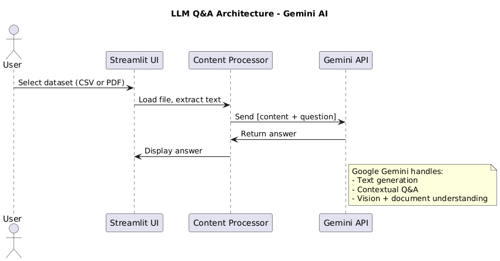

## 🧾 Credits

Created by **Daryl Bubune Atito Narh** with roll number **10211100222** as part of a final Intro to AI exam project at **Academic City University College**.

---

# 🧠 ML & AI Explorer

An interactive Streamlit application for exploring Machine Learning and AI concepts with real datasets. It includes modules for regression, clustering, neural networks, and large language model (LLM) Q&A powered by Google Gemini.

---

## 🚀 Features

- **Regression**: Predict continuous values using Linear Regression.
- **Clustering**: Apply K-Means to visualize groups using interactive 2D/3D plots.
- **Neural Network**: Build and train a feedforward neural network for classification.
- **LLM Q&A**: Ask questions using document, text, or data input via Gemini AI.

---

## 📁 Directory Structure

```
ML_AI_Explorer/
├── app.py
├── .env
├── README.md
├── requirements.txt
├── datasets/
│   ├── Ghana_Election_Result.csv
│   ├── 2025-Budget-Statement-and-Economic-Policy_v4.pdf
│   └── handbook.pdf
├── sections/
│   ├── __init__.py
│   ├── home.py
│   ├── regression.py
│   ├── clustering.py
│   ├── neural_network.py
│   └── llm_multimodal.py
├── images/
│   └── llm_architecture.png
```

---

## 🏗️ App Architecture

Each section is modular and can be selected from the sidebar. The LLM section uses preloaded datasets and Google Gemini to generate answers from structured or unstructured data.

### LLM Architecture Diagram



---

## 📊 Datasets Used in LLM Q&A

| Dataset Name | Type | Source |
|--------------|------|--------|
| Ghana Election Results | CSV | [GitHub](https://github.com/GodwinDansoAcity/acitydataset/blob/main/Ghana_Election_Result.csv) |
| 2025 Budget Statement | PDF | [MoFEP](https://mofep.gov.gh/sites/default/files/budget-statements/2025-Budget-Statement-and-Economic-Policy_v4.pdf) |
| Academic City Handbook | PDF | [Academic City](https://acity.edu.gh/downloads/handbook.pdf) |

---

## 🛠 Installation

```bash
git clone https://github.com/yourusername/ML_AI_Explorer.git
cd ML_AI_Explorer
python -m venv venv
source venv/bin/activate  # Or venv\Scripts\activate on Windows
pip install -r requirements.txt
````

---

## ⚙️ .env Configuration

Create a `.env` file in the root:

```env
GEMINI_API_KEY=your_actual_api_key_here
```

---

## ▶️ Usage

```bash
streamlit run app.py
```

---

## 🧪 Methodology (LLM Section)

1. **User selects one of 3 preloaded datasets**.
2. **Content is extracted** from the CSV or PDF.
3. **Question entered by user** is appended to the context.
4. **Gemini API is queried**, response is returned.
5. **Answer is displayed** live in the app.

---

## ⚖️ Gemini vs ChatGPT Comparison

| Feature                    | Gemini AI (Used Here) | ChatGPT               |
| -------------------------- | --------------------- | --------------------- |
| PDF/Text/Image Support     | ✅ Yes (Multimodal)    | ❌ PDF/Image via tools |
| API Integration            | ✅ Yes                 | ✅ Yes                 |
| Real-Time Streamlit Output | ✅ Yes                 | ✅ Yes                 |
| Token Context Window       | ✅ Large               | ✅ Large (GPT-4-turbo) |

---

## 📜 License

MIT License

---
